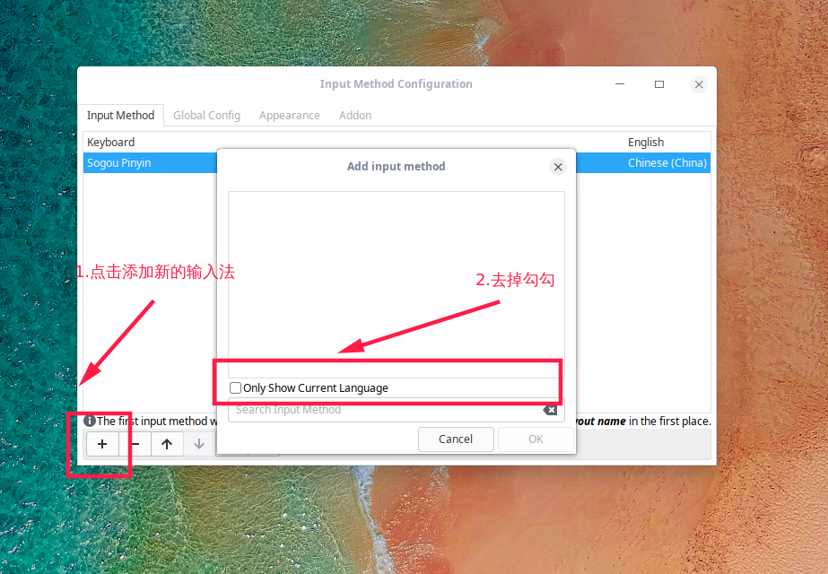

# Deepin

```shell
# 系统更新
sudo apt-get update
sudo apt-get upgrade

# 有些命令需要用到
sudo apt-get install software-properties-common
```

#### 配置shadowsocks开机自运行

```shell
# 下载好shadowsocks后执行命令使得软件可以运行
chmod a+x Shadowsocks-Qt5-3.0.1-x86_64.AppImage

# 配置shadowsocks开机自运行
cd .config/autostart
touch Shadowsocks.desktop
vim Shadowsocks.desktop

	[Desktop Entry]
	Type=Application
	Exec=/home/zhaolei/Documents/Shadowsocks-Qt5-3.0.1-x86_64.AppImage
```

#### sublime text3秘钥

```txt
----- BEGIN LICENSE -----
sgbteam
Single User License
EA7E-1153259
8891CBB9 F1513E4F 1A3405C1 A865D53F
115F202E 7B91AB2D 0D2A40ED 352B269B
76E84F0B CD69BFC7 59F2DFEF E267328F
215652A3 E88F9D8F 4C38E3BA 5B2DAAE4
969624E7 DC9CD4D5 717FB40C 1B9738CF
20B3C4F1 E917B5B3 87C38D9C ACCE7DD8
5F7EF854 86B9743C FADC04AA FB0DA5C0
F913BE58 42FEA319 F954EFDD AE881E0B
------ END LICENSE ------
```

#### 配置搜狗拼音

安装好搜狗的deb包后，点击桌面右下角的键盘按钮，设置显示搜狗拼音。

```shell
# 去掉这个勾，然后选择搜狗即可
setting -> only show local language
```

