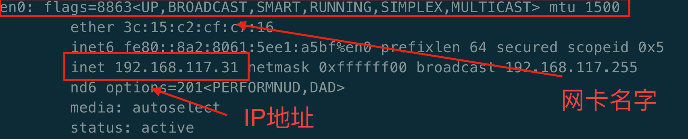

# 裸机安装coreOS单机

1. 下载[coreOS](https://stable.release.core-os.net/amd64-usr/current/coreos_production_iso_image.iso)镜像

   ```shell
   # 把coreOS的iso文件写入到U盘中
   # 以下使用Mac OS的为例
   diskutil list              											# 显示U盘挂载的路径
   diskutil unmountDisk /dev/disk2										# 卸载U盘
   																	# iso文件写入U盘
   # if为iso文件的路径，of为U盘的挂载路径													
   sudo dd if=.../coreos_production_iso_image.iso of=/dev/rdisk2 bs=1m
   
   # 可以使用命令查看写入U盘的状态
   iostat -w 2
   
   # 写入完成后执行命令弹出U盘
   diskutil eject /dev/disk2
   ```

2. 下载coreOS安装时需要的包

   * [coreos_production_image.bin.bz2.sig](https://stable.release.core-os.net/amd64-usr/current/coreos_production_image.bin.bz2.sig)
   * [coreos_production_image.bin.bz2](https://stable.release.core-os.net/amd64-usr/current/coreos_production_image.bin.bz2)
   * [version.txt](https://stable.release.core-os.net/amd64-usr/current/version.txt)

3. 生成SSH公钥

   生成SSH公钥的原因是为了可以从主机中访问到coreOS服务器。

   在主机中执行如下命令。

   ```shell
   ssh-keygen
   # 余下的过程可以默认回车
   ```

   把`~/.ssh/id_rsa.pub`文件中的内容拷贝出来。

4. 配置[cloud-config.yaml](./coreOS/cloud-config.yaml)文件

   ```yaml
   #cloud-config
   
   hostname: das-01
   
   users:
     - name: coreos
       ssh-authorized-keys:
         - ssh-rsa AAAAB3NzaC1yc2EAAAADAQABAAABAQ...
       groups:
         - sudo
         - docker
   
   ```

   其中`ssh-authorized-keys`填写的内容为上一步生成的公钥内容

5. 在自己的主机中配置需要的安装依赖文件

   1. 本地下载一个nginx服务

      ```shell
      docker run --name nginx -v [localAddr]:/usr/share/nginx/html:ro -d -p 80:80 nginx
      ```

      其中`localAddr`为本地静态文件夹的地址

   2. 放置需要的文件到`localAddr`

      * `cloud-config.yml`放置到`localAddr`中
      * 在`localAddr`中新建目录`current`,放置`version.txt`
      * 查看`vertion.txt`文件中`COREOS_VERSION_ID`的值，在`localAddr`中新建以此为名的文件夹，并在其中放置`coreos_production_image.bin.bz2.sig`、`coreos_production_image.bin.bz2`两个文件

   3. nginx静态文件的目录结构为

      

   4. 查看自己主机的ip地址

      ```shell
      ifconfig
      ```

      **这里假定ip地址为`remoteIP`**

6. coreOS安装

   在需要安装coreOS的主机中设置BIOS从装有coreOS的U盘启动，进入shell界面后执行以下命令。

   1. 下载`cloud-config.yaml`文件

      ````shell
      wget http://remoteIP/cloud-config.yaml
      ````

   2. 执行安装命令

      ```shell
      sudo coreos-install -d /dev/sda -C stable -c cloud-config.yaml –b http://remoteIP
      ```

   3. 安装完成显示`success`后，执行命令重启即可

      ```shell
      shutdown -r now
      ```

7. coreOS安装成功后

   coreOS重启后等待一会会在界面中显示网卡的信息和IP地址，这时可以通过在原来生成`ssh公钥和私钥`的主机中访问coreOS系统。

   ```shell
   ssh coreos@[coreOSIP]
   ```

   1. 设置账户和密码使得可以从coreOS中登录账户

      ```shell
      sudo passwd coreos
      ```

   2. 设置静态IP

      在 `/etc/systemd/network `目录下创建 `static.network `文件

      ```shell
      cd /etc/systemd/network
      sudo vi static.network
      ```

      添加如下信息

      ```
      [Match]
      Name=enp2s0
      
      [Network]
      DNS=192.168.0.6
      Address=192.168.124.119/24
      Gateway=192.168.124.1
      ```

      执行命令让配置生效

      ```shell
      sudo systemctl restart systemd-networkd
      ```

      **相关配置信息的获取**

      当进入到coreOS的安装程序后，可以执行命令获得`DHCP`分配的ip信息

      ```shell
      ifconfig
      ```

      从上面的命令可以获得网卡的名字，ip地址。

      

      通过命令获得网关

      ```shell
      route -n | grep "^0.0.0.0" | tr -s " " | cut -f2 -d" "
      ```

      获得DNS服务器的地址，要是在coreOS中获取不了，可以在同一个网段中的别的主机中通过命令获取。

      ```shell
      dig
      ```

      **测试配置成功**

      ```shell
      ping www.baidu.com
      ```

      ping的通则说明配置成功

   3. 设置docker的阿里云加速

      ```shell
      sudo mkdir -p /etc/docker
      sudo tee /etc/docker/daemon.json <<-'EOF'
      {
        "registry-mirrors": ["https://3tt4ayl8.mirror.aliyuncs.com"]
      }
      EOF
      sudo systemctl daemon-reload
      sudo systemctl restart docker
      ```

      直接复制到命令行执行即可

      测试是否安装成功

      ```shell
      docker run --name nginx -d -p 8080:80 nginx
      ```

      访问nginx服务查看是否安装成功

   4. 设置时区

      使用命令查看当前时间是否为北京时间

      ```shell
      date
      ```

      如果显示不为北京时间，使用下面的命令进行切换

      ```shell
      sudo timedatectl set-timezone Asia/Shanghai
      ```

      ```shell
      # 查看当前系统的时区信息
      timedatectl
      ```

      

